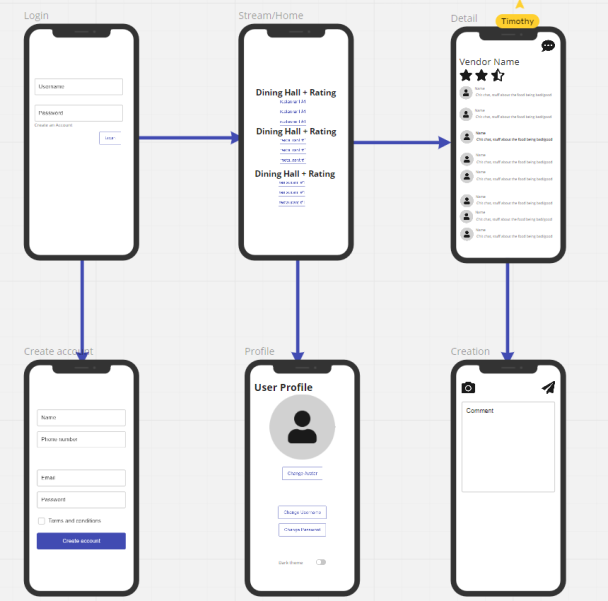
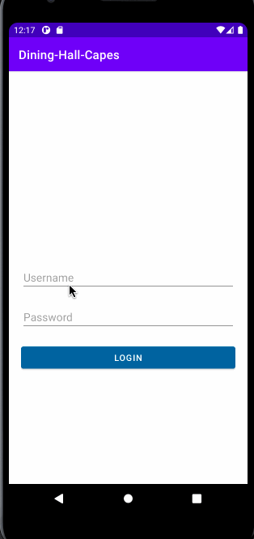

Original App Design Project - README Template
===

# RateMyHDH

## Table of Contents
1. [Overview](#Overview)
1. [Product Spec](#Product-Spec)
1. [Wireframes](#Wireframes)
2. [Schema](#Schema)

## Overview
### Description
CAPES... but for the dining halls.

### App Evaluation
[Evaluation of your app across the following attributes]
- **Category:** Social
- **Mobile:** We might adjust the app to include more features.
- **Story:** This app provides an outlet for students to discuss dining hall quality. Although there are other forms of social media, this app allows students to rate the dining halls and displays the average rating. Wouldn't it be fun to see how much the ratings vary?
- **Market:** The scale of this app would probably be limited to UCSD students that go to the dining halls. If we manage to implement one of the stretch stories, the scale theoretically would expand to any college/university.
- **Habit:** The average user may just scroll through discussion threads, but they do have the opportunity to contribute to threads if they find any nice surprises in the dining halls (good or bad, we don't know).
- **Scope:** The required stories can be completed by the end of the program with reasonable dedication.

## Product Spec

### 1. User Stories (Required and Optional)

**Required Must-have Stories**

- [X] Login system for users
- [ ] User can see the ratings of vendors and the average ratings for dining halls
- [ ] User can click into the dining halls and rate them individually, make posts (maybe with pictures)

**Optional Nice-to-have Stories**

* Like system for posts
* Authenticate user emails with the university
* Scale to other universities and other dining hall systems
* Login system redirects users to their appropriate school

### 2. Screen Archetypes

* Login/Register
   * Login system for users
   * Register the user if they are not already in the system
* Home
    * Stream Fragment
       * Dining halls with average ratings
       * Each dining hall is followed by a list of their respective vendors, which acts as a button into a comment section
    * Profile Fragment (stretch)
        * User can change profile picture and bio
        * User can change theme, username, password
        * User can logout
* Detail (might be refactored into separate activities)
    * Posts Fragment
        * Upon clicking into individual dining halls, users can rate them individually, view posts
    * Creation Fragment
        * Users can add posts into a dining hall vendor's thread

### 3. Navigation

**Tab Navigation** (Tab to Screen)

* Stream
* Profile

(These might be removed and refactored into separate activities)
* Posts
* Creation

**Flow Navigation** (Screen to Screen)

* Login Screen
    * Home
    * Registration
* Registration Screen
    * Home
* Home Screen
    * Stream Fragment
        * Detail
    * Profile Fragment
        * Change name/picture screen (stretch)
* Detail Screen
    * Posts Fragment
        * Home
    * Creation Fragment (may change to new activity if switching BottomNavigationViews is tricky)

## Wireframes

### [BONUS] Interactive Prototype

## Schema
### Models

**Post**
| Property | Type  | Description |
| -------- | -------- | -------- |
| id       | String   | unique id for the user post |
| author   | Pointer to user | post author |
| image (stretch, also optional) | File | user inputted image |
| countLikes | int    | like count for a post |

**Dining Hall**
| Property | Type  | Description |
| -------- | -------- | -------- |
| id | String | unique id for the dining hall |
| rating   | float  | (weighted) average rating of the vendors in the dining hall |
| vendors  | List<Pointer to Vendor> | a list of vendors at this dining hall |

**Vendor**
| Property | Type  | Description |
| -------- | -------- | -------- |
| id (may delete) | String | unique id for the vendor |
| discussionThread | List<Post> | vendor comments section |
| rating   | float  | rating of the vendor as a whole |

**User**
| Property | Type  | Description |
| -------- | -------- | -------- |
| id | String | unique id for users |
| username | String | username |
| password | String | password |
| image | File | user profile image |
| postedRatings | Map<Pointer to Dining Hall, integer> | A list of ratings that a user holds for the dining halls |

### Networking
- Home Screen
    - (Read/GET) Query dining halls, vendors and their ratings
- Detail Screen
    - (Delete) Delete existing comment
- Creation Screen
    - (Create/POST) Create a new comment on a post
- Profile Screen
    - (Read/GET) Query user objects
    - (Update/PUT) User updates profile image

- [Create basic snippets for each Parse network request]
- [OPTIONAL: List endpoints if using existing API such as Yelp]

### Sprint 1 Progress

### Sprint 2 Progress

