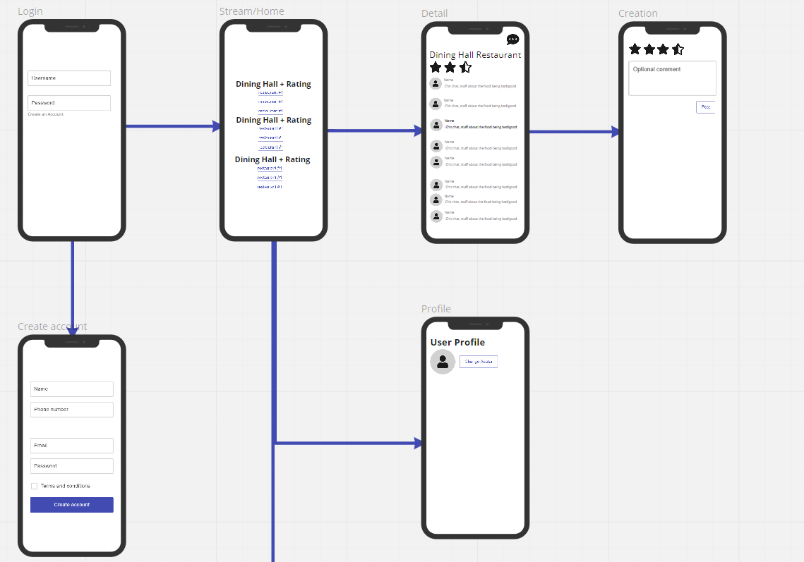

Original App Design Project - README Template
===

# RateMyHDH

## Table of Contents
1. [Overview](#Overview)
1. [Product Spec](#Product-Spec)
1. [Wireframes](#Wireframes)
2. [Schema](#Schema)

## Overview
### Description
CAPES... but for the dining halls.

### App Evaluation
[Evaluation of your app across the following attributes]
- **Category:** Social
- **Mobile:** We might adjust the app to include more features.
- **Story:** This app provides an outlet for students to discuss dining hall quality. Although there are other forms of social media, this app allows students to rate the dining halls and displays the average rating. Wouldn't it be fun to see how much the ratings vary?
- **Market:** The scale of this app would probably be limited to UCSD students that go to the dining halls. If we manage to implement one of the stretch stories, the scale theoretically would expand to any college/university.
- **Habit:** The average user may just scroll through discussion threads, but they do have the opportunity to contribute to threads if they find any nice surprises in the dining halls (good or bad, we don't know).
- **Scope:** The required stories can be completed by the end of the program with reasonable dedication.

## Product Spec

### 1. User Stories (Required and Optional)

**Required Must-have Stories**

* Login system for users
* User can see the individual and average ratings of dining hall places
* User can click into the dining halls and rate them individually, publish comments, or view discussion threads (like Reddit)
* Individual restaurant ratings determine the average dining hall rating

**Optional Nice-to-have Stories**

* Scale to other universities and other dining hall systems
* Login system redirects users to their appropriate school

### 2. Screen Archetypes

* Login/Register
   * Login system for users
   * ...
* Home
   * Dining halls with average ratings
   * Either list the places at the dining hall underneath, or be able to click into a list of places at the specific dining hall
   * ...
* Detail
    * Upon clicking into individual dining halls, users can rate them individually, view discussions
* Creation
    * Users can add comments to discussions
* Profile (stretch)
    * User can change profile picture and bio
* Settings (stretch)
    * User can change theme

### 3. Navigation

**Tab Navigation** (Tab to Screen)

* Home
* Profile

**Flow Navigation** (Screen to Screen)

* Login Screen
    * Home
    * Registration
* Registration Screen
    * Home
* Home Screen
    * Detail
* Detail Screen
    * Creation
* Creation Screen
    * Detail
* Profile Screen
    * Home
    * Change name/picture screen (stretch)
* Settings Screen
    * Home

## Wireframes

### [BONUS] Interactive Prototype

## Schema
### Models

**Post**
| Property | Type  | Description |
| -------- | -------- | -------- |
| id       | String   | unique id for the user post |
| author   | Pointer to user | post author |
| image (stretch, also optional) | File | user inputted image |

**Dining Hall**
| Property | Type  | Description |
| -------- | -------- | -------- |
| id (may delete) | String | unique id for the dining hall |
| rating   | float  | (weighted) average rating of the vendors in the dining hall |

**Vendor**
| Property | Type  | Description |
| -------- | -------- | -------- |
| id (may delete) | String | unique id for the vendor |
| discussionThread | List<Post> | vendor comments section |
| rating   | float  | rating of the vendor as a whole |

**User**
| Property | Type  | Description |
| -------- | -------- | -------- |
| id | String | unique id for users |
| username | String | username |
| password (biiig stretch) | String | password |
| image | File | user profile image |
| postedRatings | Map<Pointer to Dining Hall, integer> | A list of ratings that a user holds for the dining halls |

### Networking
- Home Screen
    - (Read/GET) Query dining halls, vendors and their ratings
- Detail Screen
    - (Delete) Delete existing comment
- Creation Screen
    - (Create/POST) Create a new comment on a post
- Profile Screen
    - (Read/GET) Query user objects
    - (Update/PUT) User updates profile image

- [Create basic snippets for each Parse network request]
- [OPTIONAL: List endpoints if using existing API such as Yelp]
